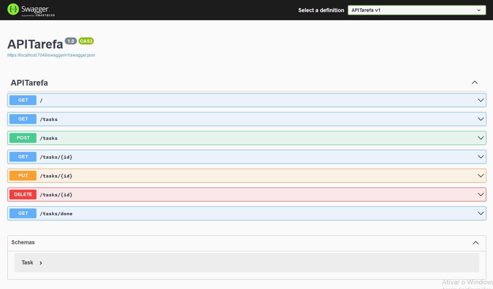

<h1 align="center"> APITarefa </h1>

<p align="center"> It's a simple Task CRUD API using minimal API.</p>

## 📽 Preview




## 💻 Main Technologies

- [Visual Studio 2022](https://visualstudio.microsoft.com/pt-br/vs/community/)
- [ASP.NET Core 8.0](https://learn.microsoft.com/pt-br/aspnet/core/?view=aspnetcore-8.0)
- [Entity Framework Core](https://learn.microsoft.com/pt-br/ef/)

## 🔥 Getting Started

```sh
# clone repo
$ git clone https://github.com/lucaseverest/APITarefa.git
```

<p>Open the project in Visual Studio 2022</p>

<p>To start the project without debugging press Ctrl + F5 </p>

The application Swagger can be accessed at [`localhost:7049/swagger/index.html`](https://localhost:7049/swagger/index.html).